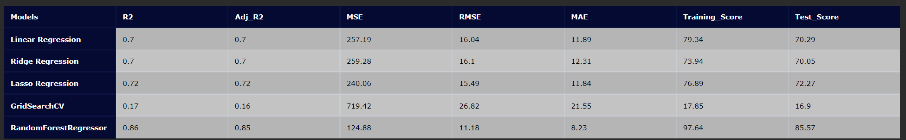
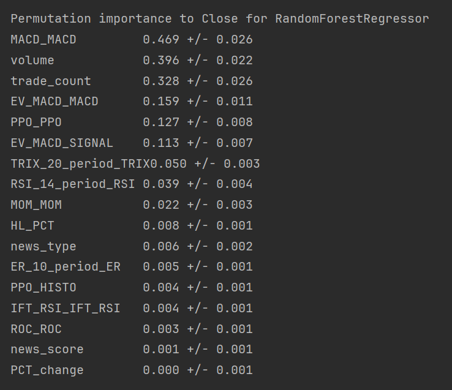
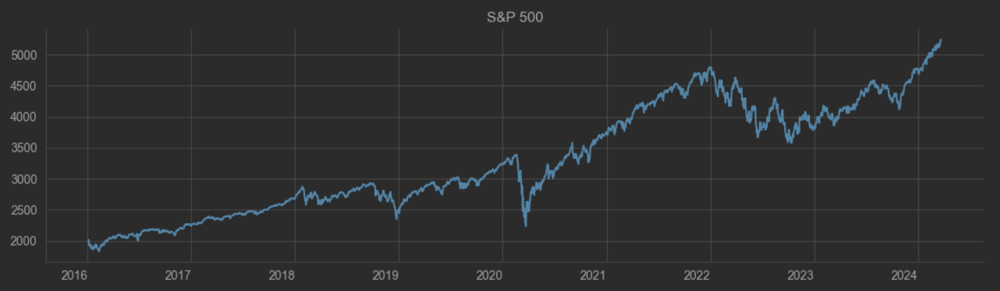
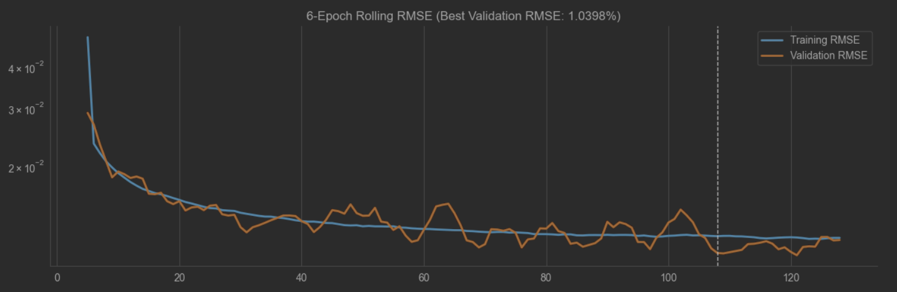
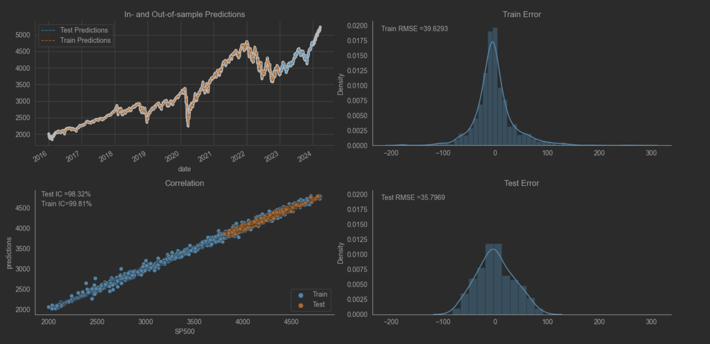
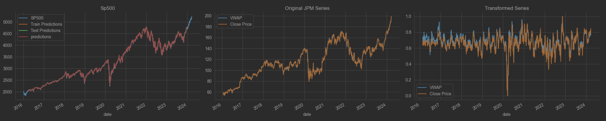
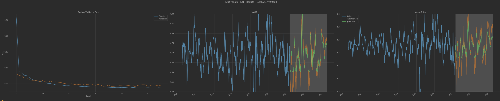
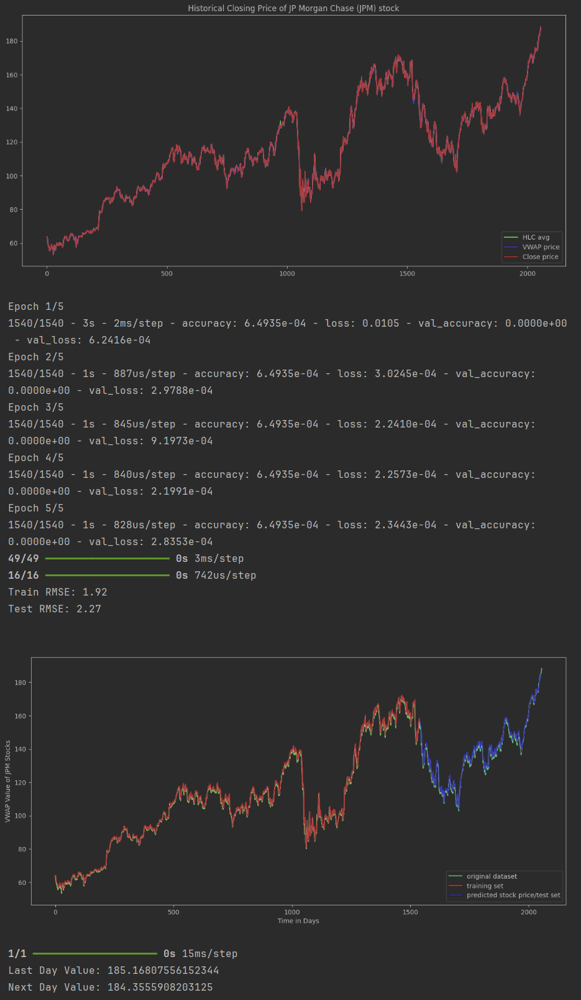
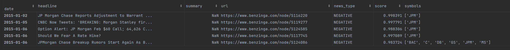

## Predicting the Stock Trend with News Sentiment Analysis and Technical Indicators 

**Plamen Stilyianov**

### Executive summary

**Project overview and goals:** The goal of this project is to predict the Stock Trend with News Sentiment Analysis and Technical Indicators.

Among all the different features considered useful in stock prediction as outlined by Tatsat et al, (2020), technical indicators 
and news are the most popular and representative: technical indicators may identify patterns behind the stock price times series, 
while financial news can indicate upcoming events that influence investors’ decisions. The use of the machine learning classification and regression frameworks, could be applied 
to build a future stock trend prediction model that combines technical analysis and fundamental analysis (financial news), also could be extended as a reporting tool of backtest performance.

A six-step CRISP-DM methodology has been used as: data collection, data preprocessing, feature generation, sentiment analysis, feature correlation analysis, and applying machine learning algorithms.

**Findings:** The best model for predicting the stock trend RandomForestRegressor model with 97.64% training score and 85.57% test score, which 
has the lowest Root Mean Square Error (RMSE) 11.18, It shows how far predictions fall from measured true values using Euclidean distance.
Adj_R2 and R-squared between 0.85 to 0.86 is acceptable in social science research especially when most of the explanatory variables are statistically significant.

**Results and conclusion:** The RandomForestRegressor model is the best performer for the prediction models.
If features are correlated, the permutation feature importance can be biased by unrealistic data instances. 
For that reason the highly correlated feature have been dropped. Permutation importance does not reflect to 
the intrinsic predictive value of a feature by itself but how important this feature is for a particular model.
Looking at news permutation importance feature to Close price, it does not show good Explainability metrics to the RandomForestRegressor.

The Long Short-Term Memory Networks model has been used for regression prediction and time-series forcasting.
The Long Short-Term Memory Networks is a deep learning, sequential neural network that allows information to persist. 
It is a special type of Recurrent Neural Network (RNNs) which is capable of handling the vanishing gradient problem faced by RNN. 
LSTM was designed by Hochreiter and Schmidhuber that resolves the problem caused by traditional RNNs and machine learning algorithms. 
LSTM Model can be implemented in Python using the Keras library.
The LSTM model is then trained to predict the target variable (e.g., the future stock price) based on the historical information.

We will explore how RNNs can be applied to univariate and multivariate time series to predict asset prices using market or fundamental data.
More specifically, we'll first demonstrate how to prepare time-series data to predict the next value for univariate time series with a single LSTM layer to predict stock index values, Next, we will demonstrate how to model multivariate time series using an RNN.

*Univariate Time Series Forecasting with LSTMs in Keras*

We obtain historical data for 2016-2024 from Yahoo for ^GSPC symbol of SP500 index

Having created input/output pairs out of our time series and cut this into training/testing sets, we can now begin setting up our RNN.  We use Keras to quickly build a two hidden layer RNN of the following specifications

- layer 1 uses an LSTM module with 20 hidden units (note here the input_shape = (window_size,1))
- layer 2 uses a fully connected module with one unit
- the 'mean_squared_error' loss should be used (remember: we are performing regression here)

Cross-validation performance shows the 6-epoch rolling average of the training and validation RMSE, highlights the
best epoch, and shows that the loss is 1.0398 percent:

The above four plots illustrate the forecast performance based on
the rescaled predictions that track the 2019 out-of-sample S&P 500 data
with a test information coefficient (IC) of 1.0398:

*Multivariate Time Series Forecasting with LSTMs in Keras*

Multivariate time-series models are designed to capture the dynamic of
multiple time series simultaneously and leverage dependencies across these
series for more reliable predictions.
At this case, we are going to use the VWAP and CLOSE data features as time-series of JPM stock for the past 7 years.

We apply the following transformation, annual difference for both series, prior log-transform to achieve stationarity on Time Series Models:
Then we scale the transformed data to the [0,1] interval:

We can reshape directly to get non-overlapping series, i.e., one sample for each year (works only if the number of samples is divisible by window size).
However, we want rolling, not non-overlapping lagged values. The create_multivariate_rnn_data function transforms a dataset of several time series into the shape required by the Keras RNN layers, namely `n_samples` x `window_size` x `n_series`.
We will use window_size of 24 months and obtain the desired inputs for our RNN model. Finally, we split our data into a train and a test set, using the last 24 months to test the out-of-sample performance.

The above plot highlights training and validation errors, and the out-of-sample
predictions for both series.

*Forcasting Next day Price for the Stock*

We have defined the LSTM with 32 neurons in the first hidden layer, 16 neurons in the second hidden layer and 1 neuron in the output layer for predicting pollution. The input shape will be 1 time step with 2 features.
We have used the Mean Squared Error (MSE) loss function and the efficient Adam version of stochastic gradient descent.
After the model is fit, we can forecast for the entire test dataset.
We have combined the forecast with the test dataset and invert the scaling. We have also inverted scaling on the test dataset with the expected pollution numbers.
With forecasts and actual values in their original scale, we can then calculate an error score for the model. In this case, we calculate the Root Mean Squared Error (RMSE) that gives error in the same units as the variable itself.

Since difference among VWAP average price, HLC average and closing value is not significant, so only VWAP average is used to build the model and prediction. 
The training and testing RMSE are: 1.92 and 2.27 respectively which is pretty good to predict future values of stock. 
Stock price of last day of dataset was 188.55 and using this model and price of next two days are predicted as 185.17 and 184.35,
which were 189.53 and 187.87 on 6th and 7th March 2024 according to Yahoo Finance. 
However, future values for any time-period can be predicted using this model.

**Data Collection**
The data consists of two parts, the financial data, and the financial news data. The former is the standard Alpaca historical data of the mentioned companies from 2016 to 2024.

**Data Preprocessing**
A simple preprocessing was performed on the raw news data. They kept only date and article columns, filtered the news relevant to the three companies by keyword search, and converted the raw texts into a cleaner format.

**Feature Generation**
Next, some additional features and three popular technical indicators were created out of the stock price information: Today Trend, Tomorrow Trend, RSI (Relative Strength Index), SMA (Simple Moving Average),

**Sentiment Analysis**
Transformers are used as a sentiment analysis tool to analyze the sentiment of each news article. Having obtained a sentiment score for each piece of news, they further grouped them by date; the overall sentiment score of any day is the aggregate score of all news on that date. “When the overall sentiment is high on a given day, the stock tends to receive much attention from traders and investors”.

**Feature Correlation Analysis**
If we look at the pairwise correlation matrix, the price features and indicator features are highly correlated, it was kept only the low correlated and removed the rest in the final dataset

**Data Collection and Preprocessing**
The OHLCV historical data of JP Morgan (JPM) over the two years from 2016 to 2024 can be easily loaded with the help of Alpaca Markets. A preliminary visualization of the closing price movement tells us how volatile this stock was in the seven years.

The relevant news headlines have been well organized in the previously mentioned dataset; let’s load it and take a glance.

