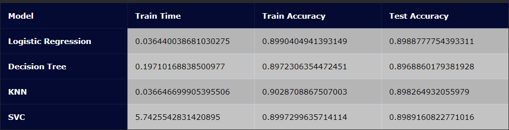

# Practical-Application-3

### Overview: 
 In this practical application, the goal is to compare the performance of the classifiers, namely K Nearest Neighbor, Logistic Regression, Decision Trees, and Support Vector Machines
 
### Data
The data is from a Portugese banking institution and is a collection of the results of multiple marketing campaigns over the telephone

### Modeling

The categorical information of train and test data has been converted in a format that may be fed into machine learning algorithms to improve prediction accuracy, because of overfiting we need to use  PCA dimensionality reduction technique.  

There are three types of models to compare their accuracy prediction scores between;
* Baseline model - a benchmark of accuracy score based on Logistic Regression model with normalised data mean=0 and std=1
* Simple models - ( Logistic Regressing, Decision Tree, KNN, SVC) using data with PCA feature extraction
* Improved dmodels - ( Logistic Regressing, Decision Tree, KNN, SVC) using hyper-parameter model tuning and data with PCA feature extraction

### Findings

* Looking at the 'Test Accuracy' we can see that all above models have improved their accuracy score after hyperparameters tuning, Logistic Regression model from 0.8972 to 0.9888, Decision Tree model from 0.8894 to 0.8968, KNN model from 0.8363 to 0.8982, SVC model from 0.8987 to 0.8989, the biggest improvements is with KNN model. 

* The 'Training Accuracy' shows a mixed picture some improvements with Logistic Regression model, with the other models we see lower scores after the model tuning.

* The 'Train Time' reveals major improvements with KNN and SVC models after the hyperparameter tuning, those models are the most run time consuming.
* the SVC Model, KNeighborsClassifier Model and LogisticRegression Model outperform the accuracy score of the Baseline Model and the other simple models. 

* Only the DecisionTreeClassifier Model got less accuracy score to the Baseline Model, but compare to simple DecisionTreeClassifier Model has greater score of 0.89689 to 0.834.

* The highest score of accuracy is 0.8989 for the SVC model, LogisticRegression Model outperform the accuracy score and score time of the Baseline Model, so the PCA Feature extraction technique does matter.

#### The Models have been optimised by using Machine Learning techniques
* PCA Feature extraction
* Hyper-parameter tuning
* Further model improvements\implementations SMOTE (synthetic minority oversampling technique) is one of the most commonly used oversampling methods to solve the imbalance problem

[Jupyter Notebook source](https://github.com/PlamenStilyianov/Practical-Application-3/blob/main/prompt_III.ipynb)